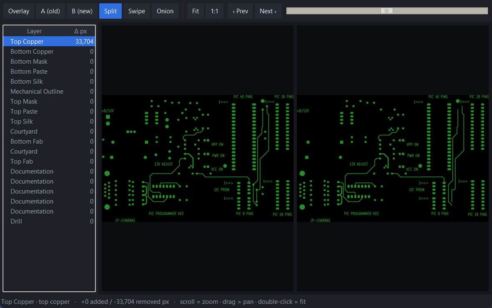

<p align="center">
  
</p>

# gerber-diff

**Free, offline, scriptable visual diff for PCB Gerber files — and schematic PDFs.**

`gerber-diff` compares two revisions of a board's fabrication data and shows you
exactly what changed: per layer (or per schematic page), with a red/green
overlay, in a self-contained HTML report you can attach to a review or archive.
It runs entirely on your machine — nothing is uploaded — and the same engine
drives a command line you can wire into CI and a small desktop GUI.

> Status: **early alpha (v0.10).** Gerber **and** schematic-PDF diff both work,
> via a CLI (`gdiff`), a desktop GUI (`gdiff-gui`), and a reusable GitHub
> Action that comments the diff on pull requests.

## Screenshots

The native viewer (`gdiff-gui`) — step through layers (changed first) and compare
each with overlay / A / B / split / swipe / onion, with pan and zoom:



The self-contained HTML report it writes for sharing — a per-layer summary plus a
colour-blind-safe orange (removed) / blue (added) / grey (unchanged) overlay, on a
real KiCad board:


The launcher:


## Why

Good Gerber diff tools exist but are either closed/paid
([gerbdiff.com](https://gerbdiff.com/)), tied to one EDA tool
([KiRi](https://github.com/leoheck/kiri) for KiCad), or thin wrappers around a
native viewer ([GrbDiff](https://github.com/dennevi/GrbDiff) over `gerbv`).
None of them are FOSS *and* cover **Gerber + schematic** in one lightweight,
cross-platform, scriptable package. That's the gap this fills.

## Features (v0.10)

- Compare two folders **or zip archives** of Gerber/drill files (fab packages
  work as-is), or two schematic PDFs — the mode is auto-detected.
- **Excellon drill files diff natively**: holes render as true circles at their
  tool diameter (a moved or resized hole shows as removed + added), with routed
  slots surfaced as a warning rather than silently skipped.
- PDF pages pair by **text content**, so an inserted or removed schematic sheet
  no longer makes every later page report as changed (order-based fallback for
  scanned PDFs).
- Automatic layer detection and pairing via
  [`gerbonara`](https://gitlab.com/gerbolyze/gerbonara)'s `LayerStack`: layers
  pair by *identity* (top copper, bottom mask, …), so pairing survives a board
  being renamed between revisions — with a filename fallback for anything it
  doesn't recognise (drills, unusual layers).
- Native raster rendering via [`pygerber`](https://github.com/Argmaster/pygerber)
  (Gerber) and [`pypdfium2`](https://github.com/pypdfium2-team/pypdfium2) (PDF)
  — **no cairo / no system libraries**, so it behaves the same on Windows,
  macOS and Linux. Layers render **in parallel** across CPU cores (~2.6× faster
  on an 18-layer board; `--jobs 1` for serial).
- **Colour-blind-safe overlay**: blue = added, orange (hatched) = removed, grey =
  unchanged — meaning never relies on hue alone, and the changed region is marked.
- Self-contained HTML report with an **interactive viewer** per changed layer
  (split side-by-side with synchronized pan/zoom · swipe · onion-skin · A/B ·
  overlay), lead-with-the-answer table (changed-first, "only changed" filter,
  jump links), light/dark theme.
- A **native desktop viewer** (`gdiff-gui`): layer-by-layer (changed first) with
  overlay / A / B / split / swipe / onion and pan-zoom, fully keyboard-driven
  (←/→ layers · `1`–`6` modes · `+`/`-` zoom · `Home` fit · `Esc` close) — plus a
  CLI (`gdiff`, also `python -m gerberdiff`).
- `--fail-on-diff` exit code, `--json` machine-readable summary, and
  `--summary-md` Markdown summary for CI.
- **Git-native**: `gdiff v1.0 HEAD --git gerbers/` diffs a directory as it
  exists at two refs (read-only, via `git archive` — no checkout juggling).
- **GitHub Action** that uploads the HTML report and posts/updates a PR comment.
- **Accessible**: keyboard-operable GUI (Tab + Enter, focus rings), colour-blind-safe
  diff, and a co-registration warning when two exports don't share a datum. Screen-reader
  users should use the `gdiff` CLI + `--json` (Tkinter exposes no accessibility tree).

### Roadmap

- Structural (net-level) schematic diff, beyond pixel diff.

## Download (Windows app — no Python needed)

Grab the latest build from the [**Releases**](https://github.com/Cimos/Gerber-Diff-Tool/releases)
page — nothing else to install:

- **`GerberDiffSetup.exe`** — installer; adds a Start-menu (and optional desktop)
  shortcut. Recommended for most people.
- **`GerberDiff-portable.exe`** — single self-contained file; runs from anywhere,
  no install. Handy on a locked-down machine or a USB stick.

It is unsigned hobby software, so Windows SmartScreen shows *"Windows protected
your PC / unknown publisher"* on first run — click **More info → Run anyway**.
To confirm a build is intact, run `GerberDiff.exe --selftest` (prints `OK`).

## Install (from source)

The project uses [`uv`](https://docs.astral.sh/uv/) for development, but it is a
standard `pyproject.toml` project, so plain `pip` works too.

```bash
# with uv (installs the right Python automatically)
uv sync
uv run gdiff --help

# or with pip, into a virtualenv
python -m venv .venv && . .venv/bin/activate   # Windows: .venv\Scripts\activate
pip install -e .
gdiff --help
```

## Usage

```bash
# Compare two Gerber revisions (folders) and write a report
gdiff path/to/rev-old path/to/rev-new -o diff-report.html

# Compare two schematic PDFs (auto-detected), page by page
gdiff rev-old.pdf rev-new.pdf -o schematic-diff.html --dpi 200

# Higher resolution, fail if anything changed, and emit a JSON summary (for CI)
gdiff rev-old rev-new -o report.html --dpmm 40 --fail-on-diff --json diff.json

# Diff the gerbers/ directory as it exists at two git refs (no checkout needed)
gdiff v1.0 HEAD --git gerbers/

# Or launch the desktop GUI
gdiff-gui
```

## GitHub Action

Get a layer-by-layer diff on every pull request that touches your fab outputs.
The action runs the diff, uploads the self-contained HTML report as an artifact,
writes a step summary, and posts (or updates) a PR comment:

```yaml
name: gerber-diff
on:
  pull_request:
    paths: ["gerbers/**"]

permissions:
  contents: read
  pull-requests: write   # for the PR comment

jobs:
  diff:
    runs-on: ubuntu-latest
    steps:
      - uses: actions/checkout@v4
        with: { fetch-depth: 0 }
      - name: Materialize the base revision
        run: |
          git worktree add /tmp/base ${{ github.event.pull_request.base.sha }}
      - uses: Cimos/Gerber-Diff-Tool@main
        with:
          old: /tmp/base/gerbers
          new: gerbers
          fail-on-diff: "false"   # set "true" to block merges on changes
```

Inputs: `old`, `new` (required), `dpmm`, `dpi`, `threshold`, `fail-on-diff`,
`comment`, `report-artifact-name`. If your Gerbers are generated rather than
committed, add your export step before the action and point `old`/`new` at the
two output folders.

The HTML report is self-contained — open it in any browser, no assets folder
required. `--json` writes per-layer counts and an overall `any_changes` flag.

## How it works

```
gerbers ─▶ pairing ────▶ render each layer ─▶ align ─▶ pixel diff ─▶ HTML report
          (gerbonara)    (pygerber → PNG)    (by bbox)  (numpy XOR)

PDFs ────▶ pages ───────▶ render each page ──▶ invert ─▶ pixel diff ─▶ HTML report
          (by index)     (pypdfium2 → PNG)              (numpy XOR)
```

The diff *engine* (`gerberdiff.pairing`, `.diff`, `.report`) has no GUI and no
renderer baked in — it is plain functions over dataclasses, which is what keeps
it testable and scriptable. Renderers live behind `gerberdiff.render` (Gerber)
and `gerberdiff.pdfdiff` (PDF) so they can be swapped without touching the diff
logic.

## Development

```bash
uv sync --extra dev
uv run pytest --cov=gerberdiff      # 70+ tests, ~98% coverage
uv run ruff check . && uv run ruff format --check .
```

CI runs ruff (lint + format) and the test suite with a coverage gate on
Ubuntu / Windows / macOS × Python 3.12 / 3.13 (see `.github/workflows/ci.yml`).

### Building the Windows app

```bash
uv sync --extra build
uv run pyinstaller GerberDiff.spec --noconfirm   # -> dist/GerberDiff/GerberDiff.exe
dist\GerberDiff\GerberDiff.exe --selftest        # prints OK if the bundle is intact
```

Pushing a `v*` tag triggers `.github/workflows/release.yml`, which builds the
one-folder app, compiles the Inno Setup installer (`GerberDiffSetup.iss`) and a
portable one-file exe, and attaches both to a GitHub Release.

## Support

gerber-diff is free and MIT-licensed. If it saved you from a bad board respin
and you'd like to say thanks, you can
[buy me a coffee](https://www.buymeacoffee.com/cimos).

Found a bug or have an idea?
[Open an issue](https://github.com/Cimos/Gerber-Diff-Tool/issues/new/choose) — the
bug-report form asks for the few details (version, OS, what you compared) that make
it fixable on the first pass.

## License

[MIT](LICENSE) © 2026 Simon Maddison
