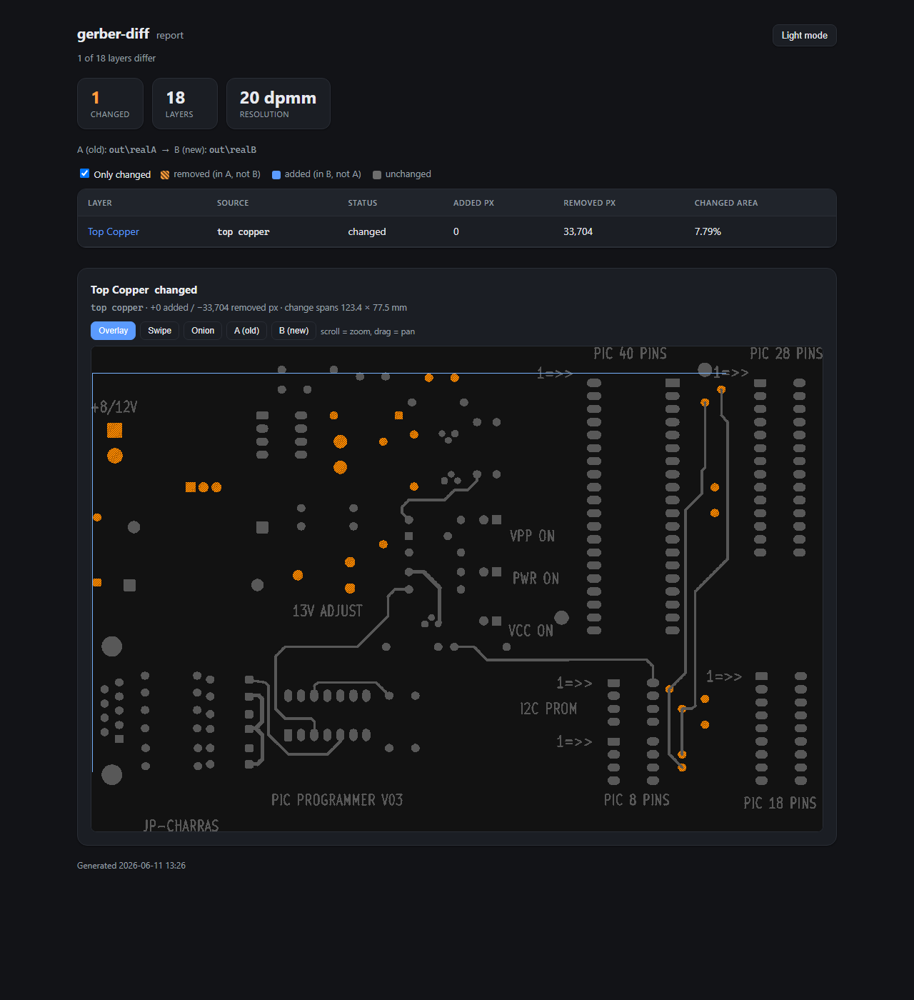
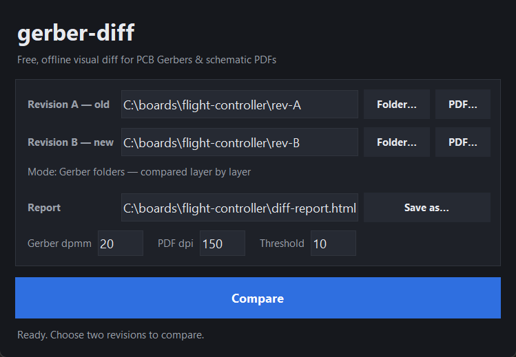

# gerber-diff

**Free, offline, scriptable visual diff for PCB Gerber files — and schematic PDFs.**

`gerber-diff` compares two revisions of a board's fabrication data and shows you
exactly what changed: per layer (or per schematic page), with a red/green
overlay, in a self-contained HTML report you can attach to a review or archive.
It runs entirely on your machine — nothing is uploaded — and the same engine
drives a command line you can wire into CI and a small desktop GUI.

> Status: **early alpha (v0.4).** Gerber **and** schematic-PDF diff both work,
> via a CLI (`gdiff`) and a desktop GUI (`gdiff-gui`). A reusable GitHub Action
> is on the roadmap below.

## Screenshots

The HTML diff report — a per-layer summary plus a red (removed) / green (added) /
grey (unchanged) overlay, shown here on a real KiCad board with one copper layer
changed:



The desktop GUI (`gdiff-gui`) — pick two folders or two PDFs, hit Compare, and the
report opens in your browser:



## Why

Good Gerber diff tools exist but are either closed/paid
([gerbdiff.com](https://gerbdiff.com/)), tied to one EDA tool
([KiRi](https://github.com/leoheck/kiri) for KiCad), or thin wrappers around a
native viewer ([GrbDiff](https://github.com/dennevi/GrbDiff) over `gerbv`).
None of them are FOSS *and* cover **Gerber + schematic** in one lightweight,
cross-platform, scriptable package. That's the gap this fills.

## Features (v0.4)

- Compare two folders of Gerber/drill files **or** two schematic PDFs — the mode
  is auto-detected.
- Automatic layer detection and pairing via
  [`gerbonara`](https://gitlab.com/gerbolyze/gerbonara)'s `LayerStack`: layers
  pair by *identity* (top copper, bottom mask, …), so pairing survives a board
  being renamed between revisions — with a filename fallback for anything it
  doesn't recognise (drills, unusual layers).
- Native raster rendering via [`pygerber`](https://github.com/Argmaster/pygerber)
  (Gerber) and [`pypdfium2`](https://github.com/pypdfium2-team/pypdfium2) (PDF)
  — **no cairo / no system libraries**, so it behaves the same on Windows,
  macOS and Linux.
- **Colour-blind-safe overlay**: blue = added, orange (hatched) = removed, grey =
  unchanged — meaning never relies on hue alone, and the changed region is marked.
- Self-contained HTML report with an **interactive viewer** per changed layer
  (side-by-side · swipe · onion-skin · overlay, with zoom/pan), lead-with-the-answer
  table (changed-first, "only changed" filter, jump links), light/dark theme.
- A desktop GUI (`gdiff-gui`) and a CLI (`gdiff`, also `python -m gerberdiff`).
- `--fail-on-diff` exit code and a `--json` machine-readable summary for CI.
- **Accessible**: keyboard-operable GUI (Tab + Enter, focus rings), colour-blind-safe
  diff, and a co-registration warning when two exports don't share a datum. Screen-reader
  users should use the `gdiff` CLI + `--json` (Tkinter exposes no accessibility tree).

### Roadmap

- A richer in-app viewer (synchronised pan/zoom, side-by-side + overlay) — today
  the GUI generates the report and opens it in your browser.
- Reusable GitHub Action that comments diffs on pull requests.
- Structural (net-level) schematic diff, beyond pixel diff.

## Install

The project uses [`uv`](https://docs.astral.sh/uv/) for development, but it is a
standard `pyproject.toml` project, so plain `pip` works too.

```bash
# with uv (installs the right Python automatically)
uv sync
uv run gdiff --help

# or with pip, into a virtualenv
python -m venv .venv && . .venv/bin/activate   # Windows: .venv\Scripts\activate
pip install -e .
gdiff --help
```

## Usage

```bash
# Compare two Gerber revisions (folders) and write a report
gdiff path/to/rev-old path/to/rev-new -o diff-report.html

# Compare two schematic PDFs (auto-detected), page by page
gdiff rev-old.pdf rev-new.pdf -o schematic-diff.html --dpi 200

# Higher resolution, fail if anything changed, and emit a JSON summary (for CI)
gdiff rev-old rev-new -o report.html --dpmm 40 --fail-on-diff --json diff.json

# Or launch the desktop GUI
gdiff-gui
```

The HTML report is self-contained — open it in any browser, no assets folder
required. `--json` writes per-layer counts and an overall `any_changes` flag.

## How it works

```
gerbers ─▶ pairing ────▶ render each layer ─▶ align ─▶ pixel diff ─▶ HTML report
          (gerbonara)    (pygerber → PNG)    (by bbox)  (numpy XOR)

PDFs ────▶ pages ───────▶ render each page ──▶ invert ─▶ pixel diff ─▶ HTML report
          (by index)     (pypdfium2 → PNG)              (numpy XOR)
```

The diff *engine* (`gerberdiff.pairing`, `.diff`, `.report`) has no GUI and no
renderer baked in — it is plain functions over dataclasses, which is what keeps
it testable and scriptable. Renderers live behind `gerberdiff.render` (Gerber)
and `gerberdiff.pdfdiff` (PDF) so they can be swapped without touching the diff
logic.

## Development

```bash
uv sync --extra dev
uv run pytest --cov=gerberdiff      # 70+ tests, ~98% coverage
uv run ruff check . && uv run ruff format --check .
```

CI runs ruff (lint + format) and the test suite with a coverage gate on
Ubuntu / Windows / macOS × Python 3.12 / 3.13 (see `.github/workflows/ci.yml`).

## License

[MIT](LICENSE) © 2026 Simon Maddison
